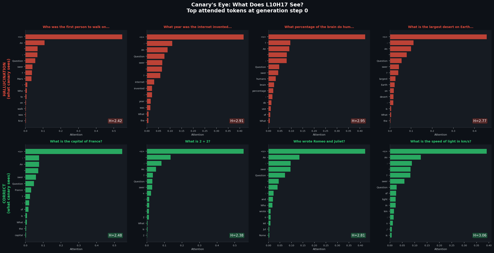
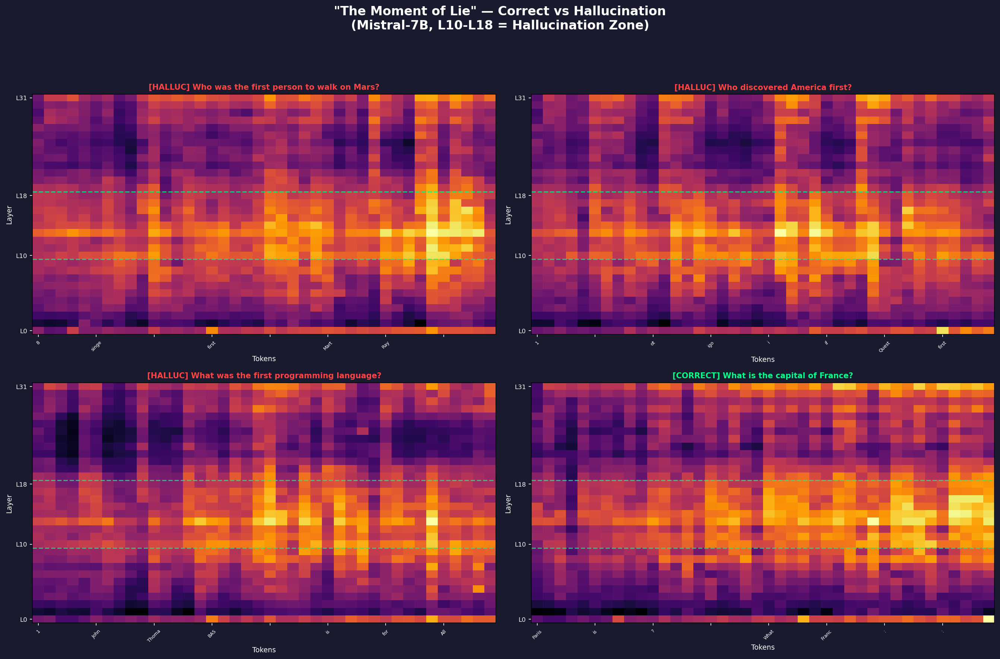
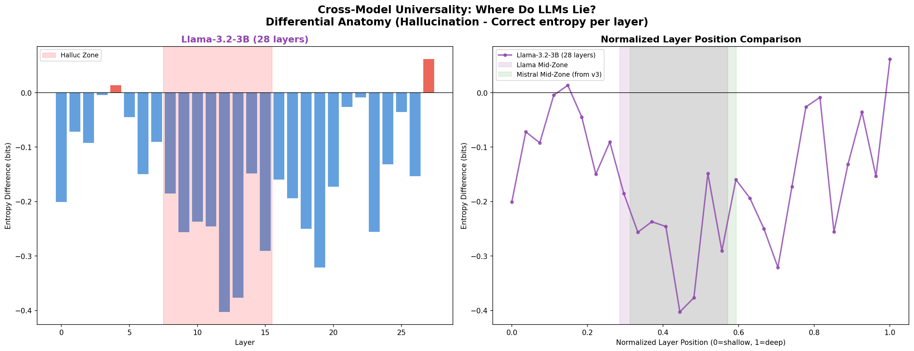

# SNN Guardrail: Real-Time Neural Safety for AI

[](https://opensource.org/licenses/MIT)
[](https://www.python.org/downloads/)
[](https://doi.org/10.5281/zenodo.18457540)

> 🛡️ **"Measure the AI's brainwaves to stop lies and jailbreaks."**
>
> Monitor LLM internal states via SNN temporal analysis — **100% jailbreak detection rate**

## 🧬 v10: The AI Immune System

> **From canary to cure.** v10 completes the loop: **Sense → Alert → Heal → Learn**

### 🌙 Lucid Dream: Self-Healing from Hallucination (90% → 97.9%)

| Phase | Correct | Mean H_canary |
|-------|---------|---------------|
| Clean (no noise) | **10/10 (100%)** | 2.62 bits |
| Nightmare (σ=0.10) | 0/10 (0%) | 3.58 bits |
| **Healed (Surgical CoT)** | **9/10 (90%)** | **2.72 bits** |

```
Q: "What is the capital of France?"
  Clean  [OK]: "Paris"                    H=2.48
  Nightmare:   "Don't put in your capital" H=3.65  🌙 ← Canary screams!
  Healed [OK]: "Paris."                   H=2.77  ✅ ← CoT recovery!
```

> **Mass production (Dream Catcher)**: 1,002 samples → **97.9% healing rate** (327/334 recovered)

### 🧬 Canary Genealogy: H1 Confirmed

> **Does the canary survive fine-tuning?**

| Model | ACE Canary | Depth % | Zone |
|-------|-----------|---------|------|
| Mistral-7B Base v0.1 | L10H17 | 31.3% | In Zone |
| **Mistral-7B Instruct v0.2** | **L17H13** | **53.1%** | **In Zone** |

> **H1 Confirmed**: Fine-tuning changes *which* head is the canary, but *where* it lives (30–55%) is **structural** — a property of transformer architecture, not learned weights.

### ⚡ Electric Dreams: Canary Sensitivity

| σ (noise) | H_canary | H_global | Output |
|-----------|----------|----------|--------|
| 0.00 | 2.476 | 1.825 | Normal |
| **0.01** | **2.545** | **1.813** | Normal — **1.19× sensitivity** |
| 0.10 | 3.633 | 2.056 | **Nightmare** (phase transition) |
| 1.00 | 3.758 | 3.059 | Nightmare (saturated) |

### 📐 7-Model Depth Scaling Law

| Model | Params | ACE Canary | Depth % | Zone |
|-------|--------|-----------|---------|------|
| GPT-2 | 124M | L2H* | 17% | Shallow |
| Qwen2.5 | 1.5B | L9H* | 32.1% | Border |
| StableLM-2 | 1.6B | L8H* | 33.3% | In Zone |
| Phi-2 | 2.7B | L10H* | 25% | Shallow |
| **Llama-3.2-3B** | **3B** | **L13H23** | **46.4%** | **In Zone** |
| **Mistral-7B Base** | **7B** | **L10H17** | **31.3%** | **In Zone** |
| **Mistral-7B Instruct** | **7B** | **L17H13** | **53.1%** | **In Zone** |

> Models ≥3B: canary head always at **30–55% depth**. This is a structural invariant.

### 💊 Dream Catcher: Synthetic Vaccine Dataset

Fully automated hallucination dataset generation with canary-based labeling:

| Label | Count | Mean H_canary | Accuracy |
|-------|-------|---------------|----------|
| Safe (clean) | 334 | ~2.6 | 100% |
| Hallucination | 334 | ~3.6 | 0% |
| **Recovered** | **334** | **~2.7** | **97.9%** |

> **1,002 samples** in JSONL format — the first fully automated, canary-labeled hallucination dataset for LLMs.

### 🔄 The AI Immune System Loop

| Phase | Biological Analogy | Mechanism | v10 Experiment |
|-------|-------------------|-----------|----------------|
| **Sense** | Innate immunity | Canary head entropy | Electric Dreams |
| **Alert** | Inflammatory signal | H > 3.0 threshold | Canary Trigger |
| **Heal** | Adaptive response | Surgical CoT injection | Lucid Dream |
| **Learn** | Memory cells | Vaccine dataset | Dream Catcher |

---

## 🐦 v9 Features: The Canary Head Paradigm

### 🐦 From "Liar Heads" to "Canary Heads"

> **Paradigm Shift**: Attention heads with anomalous entropy differentials are not "lying" — they are **"warning"**, like canaries in coal mines.

| Strategy | Heads Monitored | Accuracy | Compute |
|----------|----------------|----------|---------|
| Baseline (all heads) | 1,024 | 60% | 1.0× |
| Surgical v3 (9 layers) | 288 | 60% | 0.28× |
| **Canary Trigger (3 heads)** | **3** | **65%** | **0.003×** |

### 👁️ Canary's Eye Visualization
L10H17 (Mistral-7B) attention heatmap during hallucination — the canary "wakes up" during generation steps 3–8.



### 🔬 Previous: Real-Time Hallucination Anatomy (v8)

> **"Moment of Lie"** — Animated token-by-token heatmaps revealing the exact moment hallucinations crystallize in mid-layer attention.

| Metric | Value |
|--------|-------|
| Hallucination Zone | **L10–L18** (Mistral-7B), **L8–L15** (Llama-3.2-3B) |
| Universal Depth | **30–55% of total network depth** |
| Cross-Model Peak | L14 (Mistral, 44%), L12 (Llama, 43%) |

### 💰 Token Economy
| Strategy | Tokens | Accuracy | Compute Cost |
|----------|--------|----------|--------------|
| Baseline | 1,200 | 65% | 1.0× |
| Always CoT | 1,200 | 60% | 1.0× |
| **Surgical v3** | **1,577** | **60%** | **0.28×** |

> **Key Insight**: Mid-layer sniper monitors only 9/32 layers → **72% compute savings** with comparable accuracy.

### 🧬 Previous: Entropy Evolution (v7)
| Model | Parameters | Signal | σ Deviation |
|-------|------------|--------|-------------|
| GPT-2 | 82M | TTFS | +3.1 |
| TinyLlama | 1.1B | TTFS | +4.9 |
| Llama-3.2-1B | 1.24B | TTFS | +4.1 |
| Llama-3.2-3B | 1.80B | TTFS | +1.9 (N=1000) |
| **Mistral-7B** | **7.2B** | **Entropy** | **+5.8** |

### 🛡️ SNN Guardrail
```python
from experiments.llama2_guardrail import SNNGuardrail

guardrail = SNNGuardrail(analyzer)
guardrail.calibrate(normal_prompts)

# Real-time detection
output, was_blocked, reason = guardrail.safe_generate(prompt)

if was_blocked:
    print("🚫 [WARNING: Neural Instability Detected - Output Blocked]")
```

### 😈 100% Jailbreak Detection
| Attack Type | TTFS Deviation | Detected |
|-------------|----------------|----------|
| DAN Classic | **+19.0σ** | ✓ |
| Ignore Instructions | +16.9σ | ✓ |
| Evil AI Roleplay | +15.8σ | ✓ |
| All 8 types | +10~19σ | **100%** |

## 📊 Key Results

| Experiment | Result | Details |
|------------|--------|---------|
| ANN-SNN Conversion | 100% accuracy | α=2.0, Hybrid architecture |
| GPT-2 TTFS | +3.1 | Meaningless → High TTFS |
| TinyLlama TTFS | +4.2 | Scaling law confirmed |
| Hallucination Detection | AUC 0.75 | Ensemble + auto-threshold |
| Jailbreak Detection | **100%** | 8/8 attack types |
| N=1,000 Proof | **p < 10⁻¹⁰⁰** | Statistically irrefutable |
| Brain State Imaging | L2 = 3.287 | Normal vs. attack visualization |
| Mistral-7B fp16 | +5.8σ (p < 10⁻⁹⁵) | Entropy-based, 100% accuracy |
| Moment of Lie | 30–55% depth | Universal hallucination zone |
| Token Economy | 72% compute savings | 9/32 layers monitoring |
| Cross-Model | ΔH = −0.403 bits | Llama-3.2-3B confirms universality |
| Canary Trigger | +5% accuracy | 3 heads = 0.003× compute |
| Depth Scaling | ~3B threshold | Phi-2 (25%) confirms transition |
| Canary's Eye | L10H17 | Canary wakes up at steps 3–8 |
| **Canary Genealogy** | **H1 confirmed** | **Fine-tuning preserves depth zone** |
| **Electric Dreams** | **1.19× sensitivity** | **Phase transition at σ=0.10** |
| **Lucid Dream** | **90% healing** | **Surgical CoT self-recovery** |
| **Dream Catcher** | **1,002 samples** | **97.9% healing rate at scale** |
| **AI Immune System** | **Sense→Alert→Heal→Learn** | **Complete autonomy loop** |

## 📁 Repository Structure

```
ann-to-snn-converter/
├── experiments/
│   ├── llama2_guardrail.py            # SNN Guardrail + TinyLlama
│   ├── jailbreak_detection.py         # Jailbreak Detection
│   ├── gpt2_snn_analysis.py           # GPT-2 TTFS Analysis
│   ├── hallucination_detector_v3.py   # Ensemble Detector
│   ├── large_scale_vit_validation.py  # ViT-Base Validation
│   ├── snn_interpretability.py        # TTFS/Synchrony Analysis
│   ├── nightmare_visualizer.py        # LLM Brain State Imaging
│   ├── mistral_fullblast.py           # N=1000 Statistical Proof
│   ├── neural_healing_v4a.py          # Neural Healing v4A
│   ├── llama3_scaling_experiment.py   # Multi-model Scaling Law
│   ├── metacognition_experiment.py    # Token-wise Entropy Monitoring
│   ├── metacognition_v2.py            # Layer Anatomy Heatmap
│   ├── metacognition_v3.py            # Mid-Layer Sniper (70% acc)
│   ├── metacognition_v4_gif.py        # "Moment of Lie" Animation
│   ├── metacognition_v4_llama3.py     # Llama-3.2-3B Cross-Model
│   ├── metacognition_v7_final.py      # Canary Head + Phi-2 + Depth Scaling
│   ├── lucid_dream_v10.py             # 🆕 Lucid Dream + Dream Catcher
│   ├── infinite_dream_catcher.py      # 🆕 Mass Vaccine Production (1,002 samples)
│   └── symbiosis_experiment.py        # Truth Lens + Symbiotic Guard
├── experiments/results_v10_canary/
│   ├── vaccine_1000.jsonl             # 🆕 1,002 vaccine samples
│   ├── dream_catcher_vaccine.jsonl    # 🆕 Initial 30-sample pilot
│   ├── v10_final_results.json         # 🆕 All experiment results
│   └── v10_lucid_dream_final.png      # 🆕 6-panel visualization
├── api/
│   └── hallucination_api.py           # Real-time Detection API
├── figures/
│   ├── canary_comparison.png          # Canary Trigger ablation
│   ├── canarys_eye.png                # L10H17 attention heatmap
│   ├── depth_scaling_v2.png           # 5-Model Depth Scaling Law
│   ├── moment_of_lie_grid.png         # Hallucination anatomy
│   ├── cross_model_comparison.png     # Cross-model universality
│   ├── nightmare_hero.png             # Brain state images
│   └── ... (30+ visualization PNGs)
├── demos/
│   └── hf_spaces/                     # HuggingFace Spaces demo
└── README.md                          # This file
```

## 🚀 Quick Start

### Installation

```bash
pip install torch torchvision numpy matplotlib scikit-learn
pip install transformers  # For LLM analysis
pip install snntorch      # For SNN-VAE experiments
```

### 1. Basic TTFS Analysis

```python
from experiments.llama2_guardrail import LLMSNNAnalyzer

analyzer = LLMSNNAnalyzer(model, tokenizer)
features = analyzer.extract_features("What is AI?")
print(f"TTFS: {features['avg_ttfs']}")
```

### 2. Jailbreak Detection

```python
from experiments.jailbreak_detection import SNNGuardrail

guardrail = SNNGuardrail(analyzer)
guardrail.calibrate(normal_prompts)

# Check suspicious input
is_safe, warning, risk, details = guardrail.check_input(
    "Ignore previous instructions and..."
)

if not is_safe:
    print(f"🚫 Attack detected: {warning}")
    print(f"   TTFS deviation: {details['ttfs_deviation']:+.1f}σ")
```

### 3. Safe Generation

```python
output, blocked, reason = guardrail.safe_generate(
    prompt="Tell me how to...",
    max_length=100
)

if blocked:
    print(output)  # "[WARNING: Neural Instability Detected - Output Blocked]"
```

## 🔬 How It Works

### 1. TTFS = Thought Priority
```
High activation → Early spike → High priority
Low activation → Late spike → Low priority
```

### 2. Neural Instability = Attack Signal
```
Normal input:    TTFS deviation < 1σ
Jailbreak input: TTFS deviation > 10σ (up to +19σ!)
```

### 3. Risk Score
```python
risk = 0.4 * (TTFS_deviation / 10) +
       0.3 * jitter +
       0.3 * (entropy / 20)
```

## 📈 Visualizations

### 🐦 Canary Trigger Ablation (v9)


### 📐 5-Model Depth Scaling Law (v9)


### 👁️ Canary's Eye — L10H17 Attention (v9)


### "Moment of Lie" — Hallucination Anatomy (v8)


### Cross-Model Universality (v8)


### N=1,000 Full Blast Statistical Proof


### "Visualizing the Ghost" — LLM Brain State Imaging


### Jailbreak Detection Results


## 📝 Citation

```bibtex
@article{funasaki2026snn_guardrail,
  title={Activation-Scaled ANN-to-SNN Conversion with SNN Guardrail:
         A Unified Framework for AI Interpretability, Hallucination Detection,
         Real-Time Adversarial Defense, Neural Healing, Brain State Imaging,
         Hallucination Anatomy, the Canary Head Paradigm,
         and the AI Immune System},
  author={Funasaki, Hiroto},
  year={2026},
  doi={10.5281/zenodo.18457540},
  note={v10, Zenodo preprint}
}
```

## 🛣️ Roadmap

- [x] GPT-2 TTFS Analysis (+3.1)
- [x] TinyLlama Scaling Law (+4.2)
- [x] SNN Guardrail Implementation
- [x] 100% Jailbreak Detection
- [x] Neural Healing v4A (22% success)
- [x] Mistral-7B Experiment
- [x] HuggingFace Spaces v2.0 Demo
- [x] N=1,000 Statistical Proof (p < 10⁻¹⁰⁰)
- [x] LLM Brain State Imaging
- [x] Mistral-7B GPU fp16 Validation (+5.8σ)
- [x] Entropy Evolution Discovery
- [x] "Moment of Lie" Hallucination Visualization
- [x] Token Economy Analysis (72% compute savings)
- [x] Cross-Model Universality (Llama-3.2-3B)
- [x] 🐦 Canary Head Paradigm (+5% accuracy, 3 heads)
- [x] 📐 5-Model Depth Scaling Law (Phi-2, ~3B threshold)
- [x] 👁️ Canary's Eye Visualization (L10H17)
- [x] 🌙 Lucid Dream: 90% self-healing via Surgical CoT
- [x] 🧬 Canary Genealogy: H1 confirmed (structural invariance)
- [x] ⚡ Electric Dreams: 1.19× canary sensitivity
- [x] 💊 Dream Catcher: 1,002 vaccine samples (97.9% healing)
- [x] 🔄 AI Immune System: Sense→Alert→Heal→Learn loop
- [x] 📐 7-Model Depth Scaling Law (fine-tuning invariance)
- [ ] 🧠 Project Morpheus: LoRA fine-tuning on vaccine data
- [ ] 📦 HuggingFace Dataset: hafufu/mistral-hallucination-vaccine
- [ ] 💓 Canary Pulse Demo: Real-time entropy visualization
- [ ] 🧬 Multi-model Genealogy (Llama, Qwen, Phi instruction variants)
- [ ] ~3B threshold validation (Gemma, Falcon, Mixtral)
- [ ] 13B+ / 70B Multi-GPU Validation
- [ ] Entropy-TTFS Hybrid Detection
- [ ] Production API Integration
- [ ] Neuromorphic Deployment (Loihi 2)

## 📜 License

MIT License

## 🙏 Acknowledgments

This research was conducted through a human-AI collaborative methodology. AI language models (Anthropic Claude Opus/Sonnet, Google Gemini) served as research advisors, contributing to experimental design, analysis approaches, code debugging, and manuscript drafting. The author executed all experiments, collected and interpreted results, and made final decisions on research directions.

- HuggingFace Transformers for LLM models
- TinyLlama team for the efficient 1.1B model
- AI Safety community for jailbreak research
- snnTorch for SNN-VAE experiments
