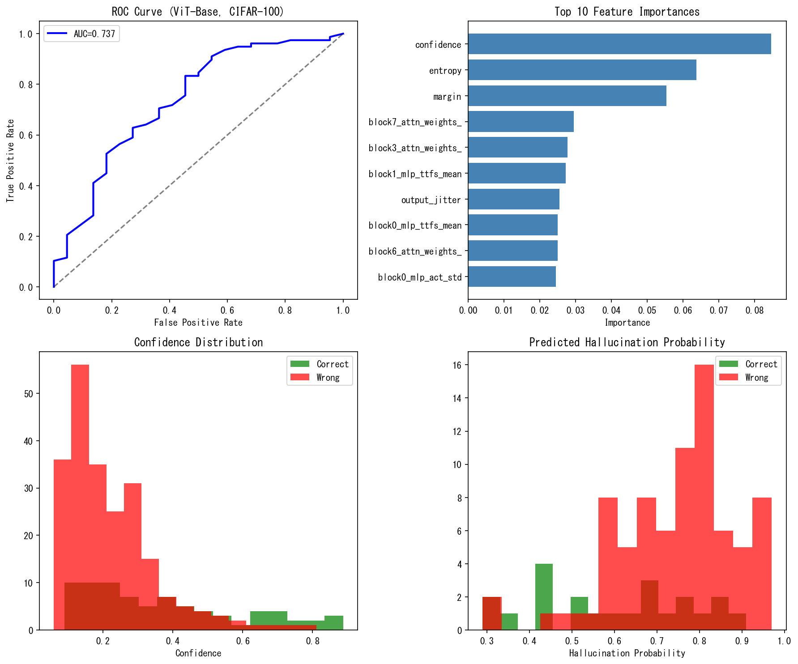

# Autonomous SNN Framework
# 自律進化SNNフレームワーク + AI解釈可能性ツール

[](https://opensource.org/licenses/MIT)
[](https://www.python.org/downloads/)
[](https://arxiv.org/)

> 🧠 SNNを「計算の顕微鏡」として使用し、ブラックボックスAIを時間軸で解剖する

## 🔥 Main Features

### 1. ANN-to-SNN変換
- **Universal Threshold Formula**: $\theta = 2.0 \times \max(\text{activation})$
- **100%精度維持** (MLP, CNN, ResNet)
- **海馬インスパイアード Hybrid Architecture**

### 2. AI Interpretability（NEW! 🆕）
- **TTFS Analysis**: 思考優先順位の可視化
- **Neural Synchrony**: 概念結合の検出
- **Spike Stability**: AI判断の安定性評価

### 3. ハルシネーション検知（NEW! 🆕）
- **AUC 0.75達成**（5-fold CV）
- **自動閾値チューニング**（F1最大化）
- **Ensemble学習**（RF + GB + LR + SVM）

## 📊 Results

| 実験 | 結果 | 詳細 |
|------|------|------|
| ANN-SNN変換 | 100%精度維持 | α=2.0, Hybrid architecture |
| GPT-2 TTFS | +3.1差 | 無意味入力→高TTFS（迷い） |
| ハルシネーション検知 | AUC 0.75 | Ensemble + 自動閾値 |
| ViT-Base検証 | AUC 0.74 | 6.4M params, CIFAR-100 |

## 📁 Repository Structure

```
autonomous-snn-framework/
├── experiments/                    # 実験コード
│   ├── snn_interpretability.py       # TTFS/Synchrony基本版
│   ├── snn_interpretability_advanced.py  # クラス別解析
│   ├── hallucination_detector.py     # v1: 閾値ベース
│   ├── hallucination_detector_v2.py  # v2: 多特徴量
│   ├── hallucination_detector_v3.py  # v3: Ensemble + 自動閾値
│   ├── transformer_snn_analysis.py   # MiniViT解析
│   ├── gpt2_snn_analysis.py          # HuggingFace GPT-2
│   └── large_scale_vit_validation.py # ViT-Base検証
├── api/                           # API
│   └── hallucination_api.py          # リアルタイム検知API
├── core/                          # コアエンジン
│   ├── evolution_engine.py           # 自律進化エンジン
│   ├── motivation.py                 # 内発的動機モジュール
│   └── self_modifier.py              # 自己改変モジュール
├── applications/                  # 各アプリケーション
│   ├── crypto_snn.py                 # 暗号・圧縮
│   ├── language_snn.py               # 言語モデル
│   └── vision_snn.py                 # 画像生成
└── paper_arxiv_v8.tex             # 論文 (v8)
```

## 🚀 Quick Start

### Requirements

```bash
pip install torch torchvision numpy matplotlib scikit-learn
pip install transformers  # GPT-2解析用
pip install fastapi uvicorn  # API用（オプション）
```

### 基本使用法

```python
# 1. TTFS解析
from experiments.snn_interpretability import SNNFeatureExtractor

extractor = SNNFeatureExtractor(timesteps=100)
features = extractor.extract(model, image)
print(f"Layer1 TTFS: {features['layer1_ttfs_mean']}")

# 2. ハルシネーション検知
from experiments.hallucination_detector_v3 import EnsembleHallucinationDetector

detector = EnsembleHallucinationDetector()
detector.fit(X_train, y_train)
risk_prob = detector.predict_proba(X_test)[:, 1]

# 閾値判定
threshold = 0.210  # 自動チューニング済み
if risk_prob[0] >= threshold:
    print("⚠️ ハルシネーションリスク高")
else:
    print("✅ 信頼できる予測")
```

### API起動

```bash
cd api
uvicorn hallucination_api:app --reload --host 0.0.0.0 --port 8000
```

## 📈 Visualizations

### TTFS & Neural Synchrony Analysis


### Hallucination Detector v3


### GPT-2 Attention TTFS


### ViT-Base Large-Scale Validation


## 🔬 Key Insights

### 1. TTFS = 思考優先順位
高い活性化 → 早いスパイク → 高優先度

### 2. Synchrony = 概念結合
同期発火するニューロン群 = 意味の塊

### 3. Jitter = 判断の不安定性
高ジッター + 高確信度 = ハルシネーションリスク

### 4. GPT-2の「迷い」
無意味入力 → Attention TTFSが+3.1増加 → モデルが「どこを見ていいかわからない」

## 📝 Citation

```bibtex
@article{funasaki2026snn_interpretability,
  title={Activation-Scaled ANN-to-SNN Conversion with SNN-Based AI Interpretability},
  author={Funasaki, Hiroto},
  journal={arXiv preprint},
  year={2026}
}
```

## 🤝 Related Work

- [Von Neumann vs Brain-like Architecture](https://zenodo.org/records/...) - 情報容量比較
- [Hybrid Spiking Neural Networks](https://zenodo.org/records/...) - ハイブリッドSNN
- [Hierarchical Memory SNN](https://zenodo.org/records/...) - 階層的記憶SNN

## 📜 License

MIT License - ろーる (cell_activation)

## 🙏 Acknowledgments

- HuggingFace Transformers for GPT-2 models
- PyTorch team for the deep learning framework
- Neuromorphic computing community for SNN research foundation
