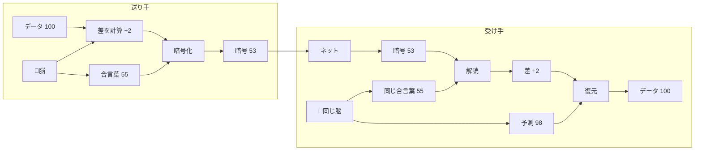
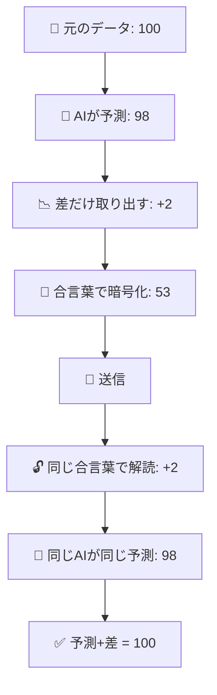

# SNN Comprypto 図解（中学生向け）

## Zennに貼れるMermaid図（シンプル版）

## もっとシンプルな図（縦版）

## 超簡単な説明

### 🧠 双子の脳みそ作戦

1. **送る人と受け取る人が、同じ「脳みそのコピー」を持っている**
   - 二人とも同じAI（SNN）を持ってる
   - 同じ入力を見ると、同じ反応をする

2. **脳みそが「次はこれだろうな」と予測する**
   - 例：「次のデータは98だろう」と予測
   - 実際のデータは100だった

3. **「予測」と「実際」の差だけを送る**
   - 100 - 98 = 2
   - 100を送るより2を送る方がコンパクト！（これが圧縮）

4. **その差を「今日だけの合言葉」で隠す**
   - 脳みその状態から合言葉を作る
   - 合言葉は毎回変わるから安全！（これが暗号化）

5. **受け取る人も同じ脳みそを持ってるから…**
   - 同じ予測ができる（98）
   - 同じ合言葉を知ってる（55）
   - だから元のデータ（100）を復元できる！

## 一言でいうと

> **「双子のAIだけが知ってる合言葉」で秘密の手紙を送る仕組み**
